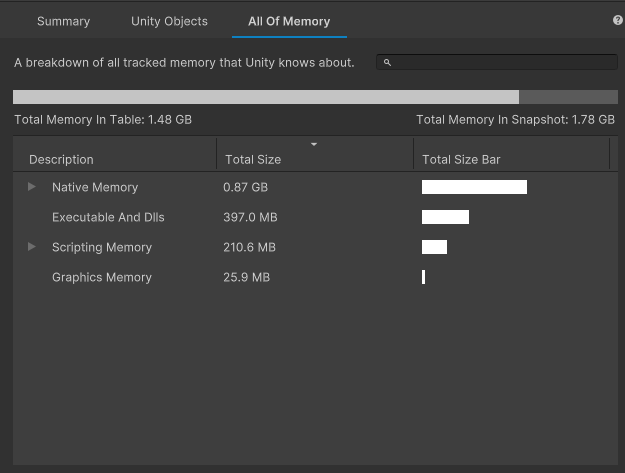

# All Of Memory tab

The __All Of Memory__ tab displays a breakdown of all the memory in the snapshot that Unity tracks. The memory usage visualized in this tab usually contains large sections of memory that either Unity or the current platform manages. Use this tab to see how much of your application's memory use isn't related to Unity objects, or to identify memory problems in your application that aren't visible in the [Unity objects tab](unity-objects-tab.md).

 The All Of Memory tab

The table in this tab displays the proportion of tracked memory that each entry uses. By default, the rows in the table are collapsed. Select the arrow icon in the description column of any row to expand it and see the child members of that row. Select the arrow icon in any expanded row to collapse it.

The __All Of Memory__ tab splits tracked memory into four different top-level categories. The following table describes each category:

|__Category__|__Description__|
|:---|:---|
|__Managed__| Displays all Virtual Machine and Managed Heap memory allocations. The Managed Heap contains data related to __Managed Objects__ and the space that has been reserved for them. It is managed by the Scripting Garbage Collector, so that any managed objects that no longer have references chain to a root are collected. The 'reserved' amount in this category may be quickly reused if needed, or it will be returned to the system every 6th GC.Collect sweep. Check [Managed memory](https://docs.unity3d.com/Manual/performance-managed-memory.html) documentation page for more details.|
|__Native__| Displays all memory that Unity allocated internally for different native objects, such Scene Objects (Game Objects and their Components), Assets and Managers, Native Allocations including Native Arrays and other Native Containers, CPU side of Graphics Asset memory, and other. This doesn't include Graphics, which is shown in a separate category. Expand this group to see the different kinds of native memory that Unity tracks.  The __Unity Objects__ subgroup displays memory that any Unity object in your application, such as a Shader or Texture2D, uses. Use this information to find areas where you could optimize memory use; you can then find these objects in the [Unity Objects tab](unity-objects-tab.md) to inspect them in more detail.  The __Unity Subsystems__ subgroup displays memory that installed modules or systems use. You can find which modules use the most memory and, if any aren't used, uninstall them to reduce how much memory your application needs.|
|__Executables & Mapped__| Displays the memory taken up by the build code of the application, including all shared libraries and assemblies, managed and native. This value is not yet reported consistently on all platforms. You can reduce this memory usage by using a higher code stripping level and by reducing your dependencies on different modules and libraries.|
|__Graphics (Estimated)__| Displays how much memory is used by the Graphics Driver and the GPU to visualize your application. The information is based on the tracking of graphics resource allocations within Unity. This includes RenderTextures, Textures, Meshes, Animations and other graphics buffers which are allocated by Unity or Scripting API. Use All Of Memory tab to explore graphics resources. Not all these objects' memory is represented in this category. For example, Read/Write enabled graphics assets need to retain a copy in CPU-accessible memory, which doubles their total memory usage. Use Unity Objects tab to explore total memory usage of Unity Objects. Also, not necessarily all memory from these type of objects resides in GPU memory. Memory Profiler is unable to get exact residence information for graphics resources.|
|__Untracked__| Memory that the memory profiler cannot yet account for, due to platform specific requirements, potential bugs or other gaps in memory tracking. The size of __Untracked__ memory is determined by analyzing all allocated regions of the process and subtracting known to Unity memory manager. To analyze this memory further, you will need to use a platform specific profiler.|

The __Native__ and __Managed__ groups have a __Reserved__ subgroup which contains memory that Unity allocated but doesn't use at the moment of capture. For more information on how to adjust how Unity reserves memory for this purpose, see [Memory allocator customization](https://docs.unity3d.com/Manual/memory-allocator-customization.html). You can enable "Show reserved memory breakdown" to see more detailed breakdown of this group.

## Table mode
Use Table Mode dropdown to see Allocated, Resident Memory usage of allocations, and their relative impact on the total usage. The dropdown changes the memory columns the table displays:
* __Allocated Memory__ - shows only Allocated memory, __% Impact__ is shown against __Allocated Memory In Table__
* __Resident Memory on Device__ - shows only Resident memory, __% Impact__ is shown against __Resident Memory In Table__
* __Allocated and Resident Memory on Device__ - shows Allocated and Resident memory, __% Impact__ is shown against __Allocated Memory In Table__

For more information on the Resident Memory see [Memory Usage On Device](memory-on-device.md).
