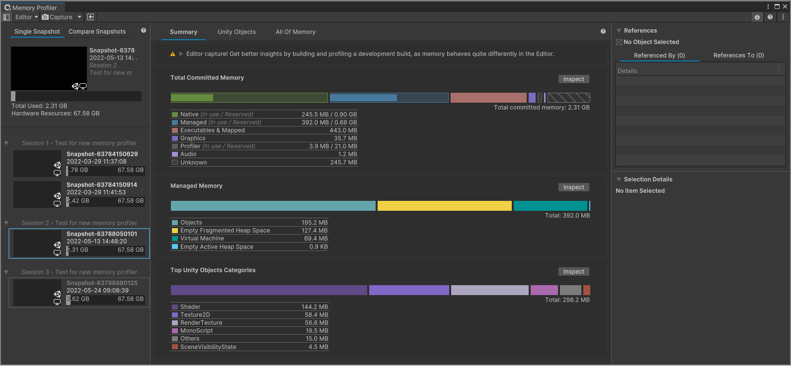

# Memory Profiler

The Memory Profiler is a tool you can use to inspect the memory usage of your Unity application and the Unity Editor. The package adds a Memory Profiler window to the Unity Editor, which you can use to capture, inspect, and compare [Snapshots](snapshots.md) of memory. Snapshots are a record of how the memory your application uses was organized when the Memory Profiler captured the snapshot.

The Memory Profiler window

The Memory Profiler window also provides an overview of native and managed memory allocations, to assess your application's memory use and identify potential issues such as memory leaks.

This package is complimenting the built-in [Memory Profiler module](https://docs.unity3d.com/Manual/ProfilerMemory.html) which provides high level memory usage information over time. The Memory Profiler package is designed to provide more detailed information about your application's memory allocations at a specific moment of time.

## Installing Memory Profiler

To install this package, follow the instructions in the [Package Manager documentation](https://docs.unity3d.com/Manual/upm-ui.html).

You can install the package using the [package registry list](https://docs.unity3d.com/Manual/upm-ui-install.html). Or using `com.unity.memoryprofiler` name when [adding a registry package by name](https://docs.unity3d.com/Manual/upm-ui-quick.html).

You can also use the following link to open the Unity Editor and install the Memory Profiler via the package manager directly: [Open the Unity Editor and install the Memory Profiler](com.unity3d.kharma:upmpackage/com.unity.memoryprofiler)

## Requirements

This version of the Memory Profiler is compatible with the following versions of the Unity Editor:

| Unity Version  | Package Version | Minimum Unity Version | Recommended Unity Version |
|----------------|-----------------|-----------------------|---------------------------|
| 2022.2 or newer| 1.x.x           | 2022.2.0a16           | 2022.2.0b1  or newer      |
| 2021.x         | 0.7.x           | 2021.1.0a1            | 2021.3.3f1 or newer       |
| 2020.x         | 0.7.x           | 2020.1.0a1            | 2020.3.35f1 or newer      |
| 2019.x         | 0.7.x           | 2019.3.0f1            | 2019.4.29f1 or newer      |

When you install the Memory Profiler package, Unity automatically installs the [Editor Coroutines](https://docs.unity3d.com/Packages/com.unity.editorcoroutines@0.0/manual/index.html) package as a dependency.

## Data concerns when sharing snapshots

The memory snapshots you take with the Memory Profiler UI or the [Memory Profiler API](https://docs.unity3d.com/Documentation/ScriptReference/Profiling.Memory.Experimental.MemoryProfiler.html) contain the entire contents of the managed heap of the Player or Editor instance you are capturing.

You can see most of the data through the Memory Profiler UI, with the exception of managed allocations that do not have a garbage collection handle. These allocations might be related to Mono type data, or allocations that the garbage collector has already collected and released but the memory section they were located in has not been overwritten with new data yet. The latter happens because garbage-collected memory is not "stomped" for performance reasons.

The kind of data that you can explore in areas such as the __All Managed Objects__ view gives you an idea of what data could be included in the memory snapshot. The Memory profiler includes any object instance of a class, all fields on that object, as well as the class’ statics excluding literals such as const values.

The Memory Profiler stores fields depending on the data type:

* It stores [value types](https://docs.microsoft.com/en-us/dotnet/csharp/language-reference/keywords/value-types) by their value
* It stores [reference types](https://docs.microsoft.com/en-us/dotnet/csharp/language-reference/keywords/reference-types) as pointer addresses. The UI resolves any pointer address as a link to the object the address points to.

For example, string type fields might indicate via their name what the string they point to means. So searching for a field named "Password", "Credentials" or "Token" might identify strings with sensitive data. If Unity has garbage collected the object that points to the string, or even the string itself, the data might still be there. However, it is no longer easily identifiable, unless you have a rough idea of what you're looking for or part of the string value to search for.

**Note:** The previous section only mentions string data as potentially problematic, but this issue isn't exclusive to strings and might happen in other forms as well, such as field or type names.

One way to safeguard against accidentally disclosing personally-identifying information, credentials or similar confidential data when you share snapshot files outside of your teams, is to put that data into constant fields. Constant fields bake that data into the binary executable, which the Memory Profiler does not capture. However, a binary executable might be de-compiled by users and expose the data that way.

You can only take a memory snapshot in development Players, so these fields might be non-const in release builds, which will make it more difficult to get to the data, but not entirely impossible.

If you have any further questions regarding this topic, use the [Unity Forum thread](https://forum.unity.com/threads/data-concerns-when-sharing-snapshots.718916/) to discuss this issue.

## Additional resources

* [Profiler overview](https://docs.unity3d.com/Manual/Profiler.html) - Documentation about how to use Unity's built-in profiler.
* [Ultimate guide to profiling Unity games](https://resources.unity.com/games/ultimate-guide-to-profiling-unity-games) - A guide describing how to profile an application including best practices, recommended workflows and advice.
