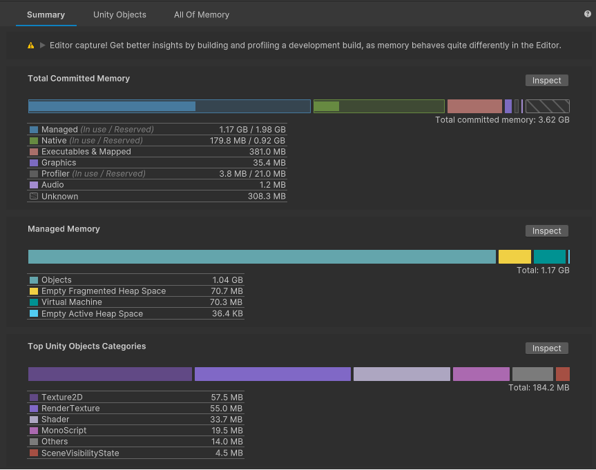

# The Main Component

The Main Component displays various data visualizations about the selected Memory Snapshot. You can control which visualizations the Main View displays with the toolbar. The Main Component contains the following tabs:

 *The Main Component in the Memory Profiler window*

|__Page__|__Description__|
|:---|:---|
|[The Summary tab](summary-tab.md)| Provides a general overview of how the memory in your application is distributed. |
|[The Unity Objects tab](unity-objects-tab.md)| Provides a detailed breakdown of how much memory each type of Unity Object in the snapshot uses. |
|[The All Of Memory tab](all-memory-tab.md)|Provides a detailed breakdown of all the tracked memory in the snapshot, not limited to Unity Objects. |
