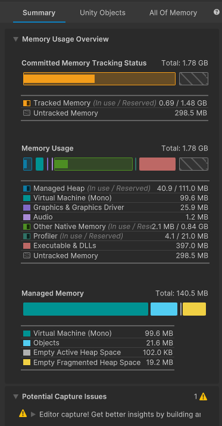

# The Main Component

The Main Component displays various data visualizations about the selected Memory Snapshot. You can control which visualizations the Main View displays with the toolbar. The Main Component contains the following tabs:

* [The Summary tab](summary-tab.md)
* [The Unity Objects tab](unity-objects-tab.md)
* [The All Of Memory tab](all-memory-tab.md)

 *The Main Component in the Memory Profiler window*
