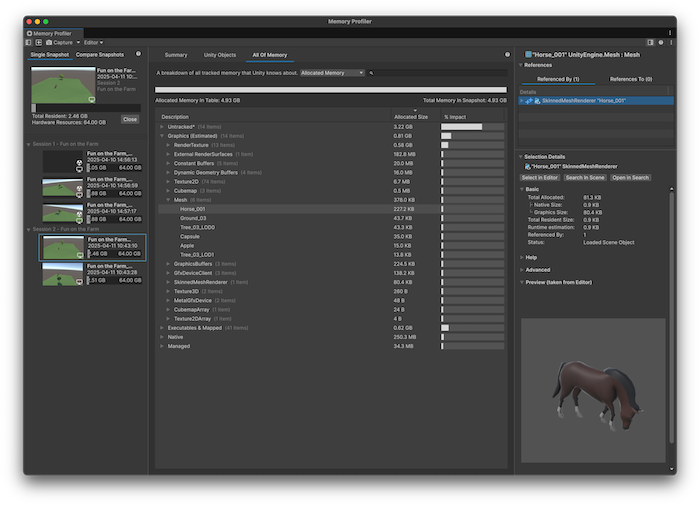

# Main panel reference

The main panel of the Memory Profiler window displays various data visualizations about the selected memory [snapshot](snapshots.md) and is divided into the following tabs:

* [**Summary tab**](#summary-tab): Provides an overview of how the memory in your application is distributed.
* [**Unity Objects tab**](#unity-objects-tab): Provides a breakdown of how much memory each type of Unity object in the snapshot uses.
* [**All Of Memory tab**](#all-of-memory-tab): Provides a breakdown of all the tracked memory in the snapshot, not limited to Unity objects.

 *The main panel in the Memory Profiler window, with the Summary tab open.*

## Summary tab

The Summary tab displays general information about the state of memory in the selected snapshot or snapshots. You can investigate the information the Summary tab displays in more detail in the other available tabs.

The top of the tab sometimes displays contextual warnings or additional useful information about the snapshots, such as potential issues with your snapshot and insight about how to understand an Editor capture.

The following table describes the sections available in the Summary tab:

|__Section__|__Description__|
|:---|:---|
|__Memory Usage On Device__| The entire application's RAM footprint on the device. This is the memory allocated as part of the application's process at the time of the capture, broken down into how much of it is resident (mapped to physical memory), and how much is only allocated in memory. It includes memory tracked by Unity's memory manager and any untracked memory. |
|__Allocated Memory Distribution__| Displays how the allocated memory is distributed across different memory categories.|
|__Managed Heap Utilization__| Displays a breakdown of the memory that Unity's scripting virtual machine (VM) manages, which includes managed heap memory used for managed objects, empty heap space that might've previously been used by objects or been reserved during a heap expansion, and memory used by a virtual machine itself. |
|__Top Unity Objects Categories__| Displays which types of Unity Objects use the most memory in the snapshot.|

> [!TIP]
> Select any of the entries in the charts to display further information about the categories in the [Selection Details panel](selection-details-component.md).
> Hover over any of the bars in the tab to highlight the corresponding label, and vice versa. For the __Allocated Memory Distribution__ metric, the Memory Profiler displays how much of each category is resident memory or allocated, if that information is available. Continue hovering your cursor over the bar or label to display a tooltip that displays how much that element contributes to the total, as a percentage.

# Unity Objects tab

The Unity Objects tab displays any Unity objects that allocated memory, how much native, graphics, and managed memory each object uses, and the combined total. Use this information to identify areas where you can remove duplicate memory entries or to find which objects use the most memory.

 _The Unity Objects tab._

> [!NOTE]
> The search bar can only search for the text displayed in the Description column.

### Memory mode

Use the dropdown menu at the top of the tab to choose what memory usage to display. Choose from:

|__Option__|__Description__|
|---|---|
|__Allocated Memory__ | Displays only allocated memory. __% Impact__ is calculated against the allocated memory in the table.|
| __Resident Memory on Device__| Displays only resident memory.  __% Impact__ is calculated against the resident memory in the table.|
|__Allocated and Resident Memory on Device__| Displays allocated and resident memory. __% Impact__ is calculated against the allocated memory in the table and highlights the portion of allocated memory that is resident.|

For more information about resident memory refer to [Memory usage on device](memory-on-device.md).

### Table information

The following columns are available in the Unity Objects table:

|__Column__|__Description__|
|:---|:---|
|__Description__| The name of each individual object or group of objects. Can't be disabled. |
|__Allocated Size__| The amount of memory the object or group of objects allocated, in bytes. |
|__Resident Size__| The amount of memory of the object or group of objects that is resident, in bytes. |
|__% Impact__| The amount of memory the object or group of objects uses as a percentage of the __Allocated Memory In Table__ value, or the  __Resident Memory In Table__ if the table is in __Resident Memory on Device__ mode. All measurement bars, including the __Allocated Memory In Table__/__Resident Memory In Table__ bar, adjust dynamically based on the search filter applied to the table.|
|__Native Size__| The amount of native memory which makes up the __Allocated Size__ value. |
|__Managed Size__| The amount of managed memory which makes up the __Allocated Size__ value. |
|__Graphics Size__| The amount of graphics memory which makes up the __Allocated Size__ value. |

## Display options

Use the checkboxes at the bottom of the window to change how the data is displayed:

|__Option__|__Description__|
|---|---|
|__Flatten Hierarchy__| Expands all objects into single entries instead of collapsible groups.|
|__Show Potential Duplicates Only__| Displays only instances where objects might be separate instances of the same object. When you enable this toggle, the Memory Profiler window groups any objects in the table with the same name, size, and type together.|

# All Of Memory tab

The **All Of Memory** tab displays a breakdown of all the memory in the selected snapshot. The memory usage displayed in this tab contains large sections of memory allocated from the following places:

* Through Unity and its graphics API integration.
* Direct from the current platform's operating system. This type of allocation bypasses Unity's memory manager, making it __Untracked__. Memory can be directly allocated in this way through native plug-in code, or with C# methods such as `Marshall.AllocHGlobal`.

Use this tab to understand how much of your application's memory use isn't related to Unity objects, or to identify memory problems in your application that aren't visible in the [Unity objects tab](#unity-objects-tab).

 _The All Of Memory tab._

### Memory mode

Use the dropdown menu at the top of the tab to choose what memory usage to display. Choose from:

|__Option__|__Description__|
|---|---|
|__Allocated Memory__ | Displays only allocated memory. __% Impact__ is calculated against the allocated memory in the table.|
| __Resident Memory on Device__| Displays only resident memory.  __% Impact__ is calculated against the resident memory in the table.|
|__Allocated and Resident Memory on Device__| Displays allocated and resident memory. __% Impact__ is calculated against the allocated memory in the table.|

### Table information

The table in this tab displays the proportion of tracked memory that each entry uses. Select the arrow icon in the description column of any row to expand it and display the child members of that row.

Tracked memory is divided into the following different top-level categories:

|__Category__|__Description__|
|:---|:---|
|__Managed__| Displays all VM and [managed heap memory allocations](xref:um-performance-managed-memory-introduction). The reserved amount in this category might be quickly reused if needed and if any new allocations fit within one of the free spaces. For more information, refer to [Managed memory](xref:performance-managed-memory).|
|__Native__| Displays all memory that Unity allocated internally for different native objects, such as GameObjects and their components, assets and managers, native allocations including NativeArrays and other native containers, and the CPU side of graphics asset memory. This doesn't include graphics, which is in a separate category. Expand this group to display the different kinds of native memory that Unity tracks: <ul><li>__Unity Objects__:  Displays memory that any Unity object in your application, such as a Shader or Texture2D, uses.</li><li>__Unity Subsystems__: Displays memory that different Unity modules or systems, and native plug-ins that allocate their memory through the [Memory Manager API for low-level native plug-ins](xref:um-low-level-native-plugin-memory-manager-api), use. You can find which modules use the most memory and, if any aren't used, [deactivate them in the Package Manager](xref:um-upm-ui-disable) or remove the plug-ins from your project to reduce how much memory your application needs.</li></ul>|
|__Executables & Mapped__| Displays the memory taken up by the build code of the application, including all shared libraries and assemblies, managed and native. This value isn't reported consistently on all platforms. You can reduce this memory usage by using a higher code stripping level and by reducing your dependencies on different modules and libraries.|
|__Graphics (Estimated)__| Displays an approximation of how much memory the graphics driver and the GPU uses to visualize your application. The information is based on the tracking of graphics resource allocations within Unity. For detailed information on how this metric tracks allocations, refer to [Graphics memory](memory-on-device.md#graphics-memory).|
|__Untracked__| Memory that the Memory Profiler can't account for, due to platform specific requirements, potential bugs, or other gaps in memory tracking. The size of Untracked memory is determined by analyzing all allocated regions of the process and subtracting it from the amount of memory known to Unity memory manager. To analyze this memory further, you need to use a platform specific profiler. If the table mode is not set to __Allocated Memory__, this category includes __Graphics (Estimated)__.|

The __Native__ and __Managed__ groups have a __Reserved__ subgroup which contains memory that Unity allocated but doesn't use at the moment of capture. For more information on how to adjust how Unity reserves memory for this purpose, refer to[Memory allocator customization](xref:um-memory-allocator-customization).

For more information on Resident Memory refer to [Memory usage on device](memory-on-device.md).

## Additional resources

* [Snapshots panel reference](snapshots-component.md)
* [References panel reference](references-component.md)
* [Selection Details panel reference](selection-details-component.md)
