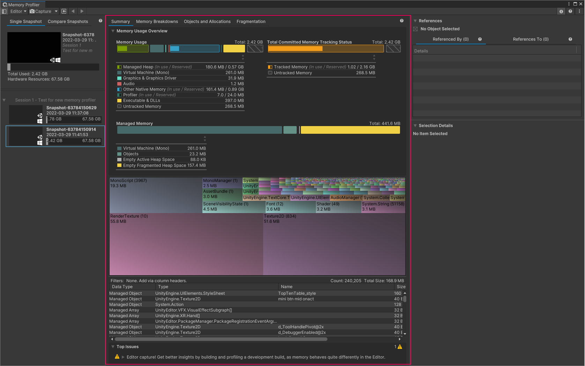

# The Main View

The Main View displays various data visualizations about the selected Memory Snapshot. You can control which visualizations the Main View displays with the toolbar. The Main View can display the following views:

* [Summary view](summary-view)
* [Memory Breakdowns view](memory-breakdowns-view)
* [Objects and Allocations view](objects-and-allocations-view)
* [Fragmentation view](fragmentation-view)

