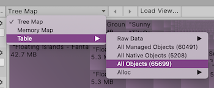

# The Main View

In the Main View of the Memory Profiler window, you can view your open memory snapshot data in different ways. At the top of the Main View, select the __View__ drop-down to choose how to view your data from either [Tree Map](tree-map), [Memory Map](memory-map), or various types of [Table views](table).

 *Select a view from the Main View toolbar*

Use the two arrow buttons in the toolbar to go back and forward in the view history. For example, you follow references through a chain of referencing objects, you can use the arrows allow you to return to previous views quickly, like a web browser's back button.

Select the __Load View__ button to import a custom view defined in an .xml file.

For more information on the views available, see the documentation in this section:

* [Tree Map](tree-map)
* [Memory Map](memory-map)
* [Table views](table-view)