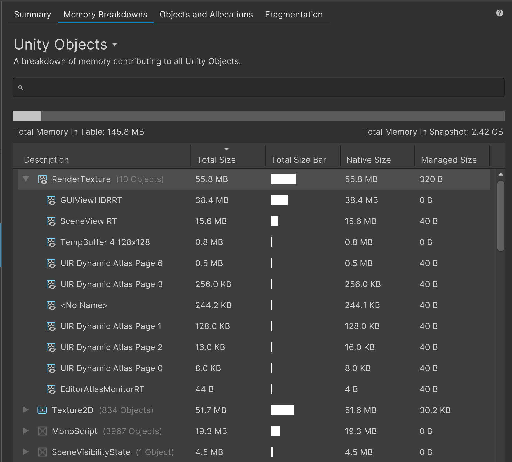

# Memory Breakdowns

The Memory Breakdowns tab displays a broader view of how the memory in your snapshot is distributed. Use this information to identify areas where you can eliminate duplicate memory entries or to find which objects use the most memory. The tab has three views which provide different insights into your snapshot:

* The Unity Objects view shows any Unity objects that use memory.
* The Potential Duplicates view shows where the same object might be instantiated more than once.
* The All Tracked Memory view shows all the memory that Unity tracked at the time of the snapshot.

The **Total Size Bar** describes the items as a percentage of the total memory used in the snapshot. To change which view is active, select the name of the view to open the selection dropdown menu and select the desired view from the dropdown menu.

All three views include a search bar, a visualization of how much memory is displayed, and a table that contains the list of objects relevant to that view.

Use the search bar to find entries in the table which contain the text you enter.

> [!NOTE]
> The search bar can only search for items that contain text in the target objects name. This will be changed to include other search functionality in future updates.

The bar visualization shows how much memory the current view represents, as a percentage of the total memory in the snapshot.

By default, the table lists all relevant objects by **Total Size** in descending order. You can click on a column header name to sort the table by that column, or right-click on a column name to open a sub-menu to hide or show any column.

The and **Total Size Bar** columns display the data as a percentage of the **Total Memory In Table** value.

The Unity Objects and Potential Duplicates views also have a **Flatten Hierarchy** toggle. Select this toggle to collapse or expand any hierarchical entries in the tables, such as grouped entries.

## Unity Objects view

This view groups objects of the same type together to show how much of the total memory in the table each type uses. You can select a group to expand it and see all objects belonging to that group, as well as the percentage of the total memory in the table that they individually use.

Use this view to identify which types of objects use the most memory and find areas where you can save some memory. The following screenshot shows the Unity Objects view with an expanded RenderTexture group:

## Potential Duplicates view

This view presents the same visualizations as the Unity Objects view, but populates the table with information about duplicated memory use. The view groups any objects in the table with the same name, size, and type together. You can then look through the list to separate any similar objects that should be independent from those that are two instances of the same object.

## All Tracked Memory view

This view displays a breakdown of all the memory in the snapshot that Unity tracks.The memory usage visualized in this view usually contains large sections of memory that either Unity or the current platform manages.
