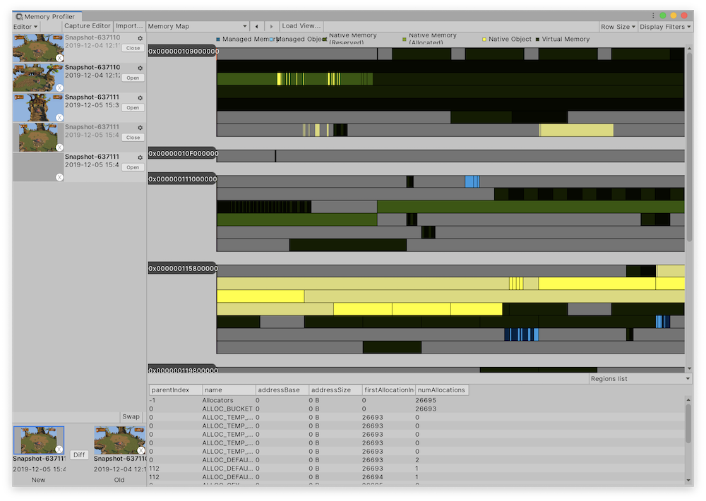
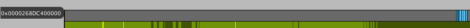
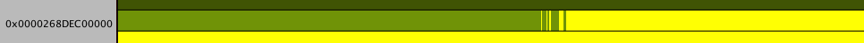
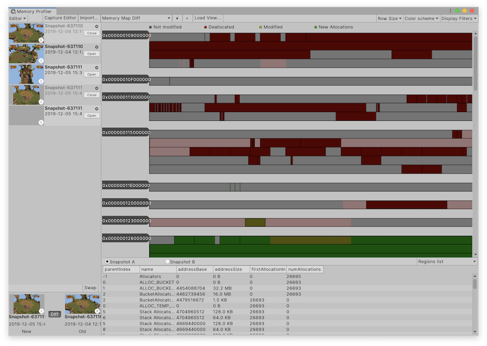

# Memory Map view

The Memory Map view helps you visualize how the virtual memory of your snapshot is laid out:

To adjust how Unity displays the information, use the toolbar at the top of the window. 

|**Setting**|**Function**|
|:---|:---|
|__Row Size__| Set how much virtual address space the Memory Profiler allocates to one row. You can choose from values between 32 KB and 256 MB.|
|__Display Filters__| Select which data to view in the Memory Map:|
|Allocations| Display native allocations.|
|ManagedObjects| Display managed objects in managed heaps.|
|NativeObjects| Display native objects inside native regions.|
|VirtualMemory| Display virtual memory regions, which is reserved address space that isn't assigned to any memory.|

## Addresses

The left side of the view contains labels of the first virtual addresses that correspond to the row on the right:

If there is a black background behind the label, it means that this is the beginning of a group and there is a discontinuity between this group and the address space of the group before it. Click on the group to select the whole block of memory (up until the next discontinuity).

If the label has no background, that means the addresses are part of a memory block. When you click on them, there is no effect. Labels appear every ten lines of a continuous address space block to help orient yourself while navigating in this view.

Click on a region of memory to select it, or click and drag to select a section of memory that interests you. When you do, the details about the address space will be updated to represent the selected range.

## Memory Map Table view

Below the Memory Map, the [Table view](table-view.md) displays details about the selected range. Use the drop-down menu at the top of the window to switch between views:

* Regions list
* Allocations list
* Objects list

## Memory Map Diff view

To see the Memory Map view for the diff of two snapshots, select the __Diff__ button to compare two snapshots, and then in the __View__ dropdown, select __Memory Map__. 

 *Memory Map Diff view*

The view is similar to the main Memory Map view, but has the following differences:

* You can adjust the color scheme of the Memory map. Select the __Color scheme__ drop-down menu and choose from either __Normal, Allocated, or Deallocated__. You can use this to highlight new allocations or deallocated memory. It makes it easier to see how memory changes between snapshots.
* In the table view, two buttons appear above it: __Snapshot A__ and __Snapshot B__. Use these to switch between displaying the data of either of the two snapshots for the selected range.
