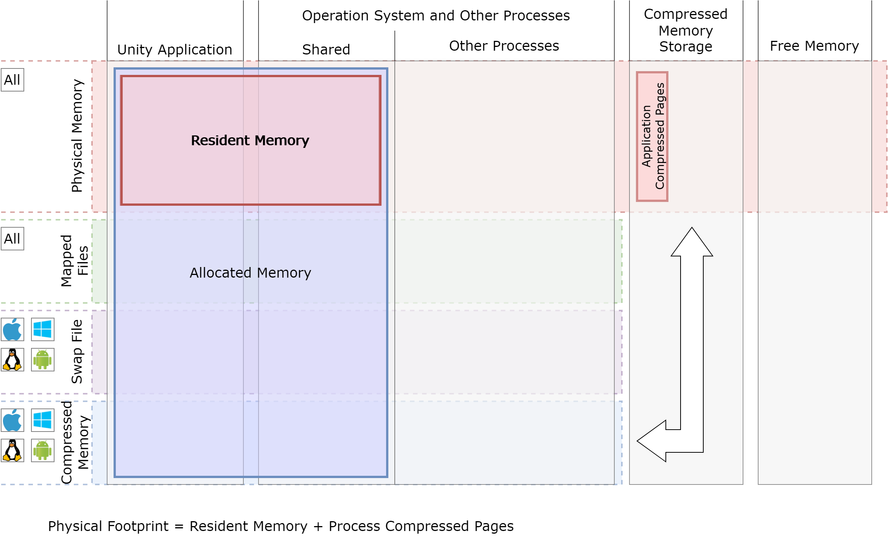
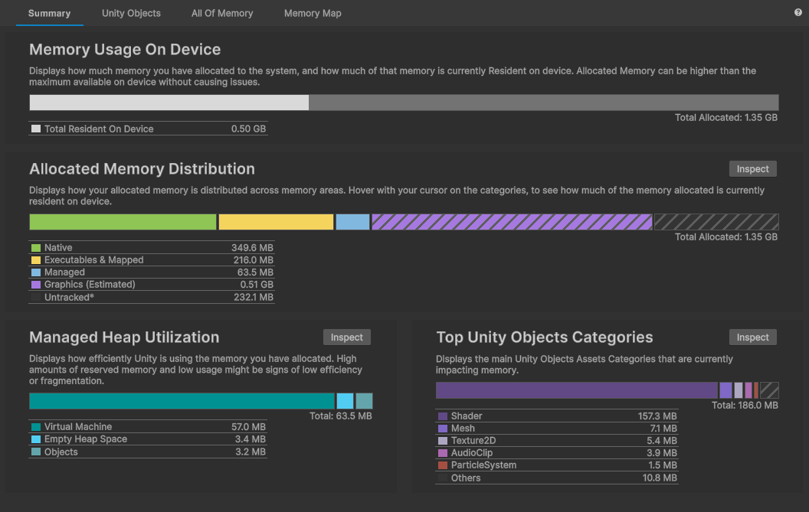
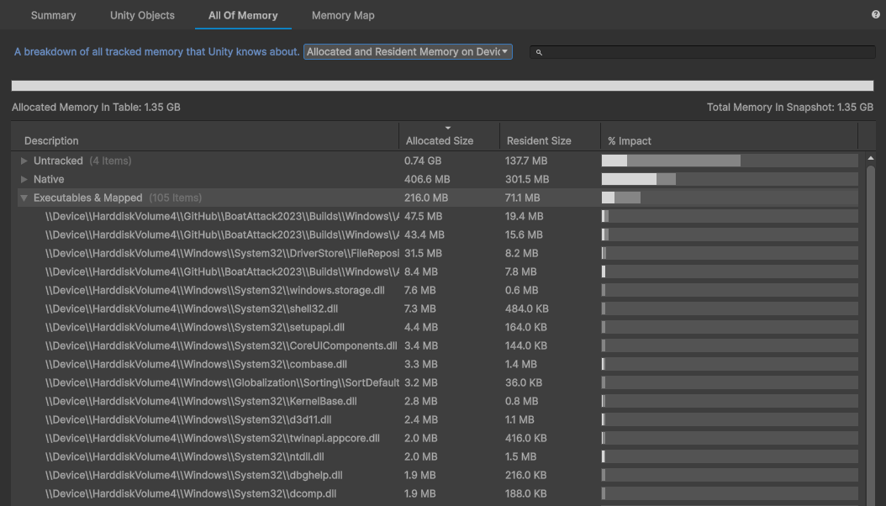

# Memory Usage On Device

Starting with Memory Profiler 1.1, the __Summary__, __Unity Objects__, and __All Of Memory__ views in addition to __Allocated memory__ size also provide information about __Resident memory__. Resident Memory of a process is a fraction of the Allocated memory of the process that is currently resident in physical memory.

> [!NOTE]
Resident memory information will only be shown for Memory Profiler snapshots made with __Unity 2022.2 or newer__. With older snapshots, you’ll still see Allocated memory only.

The Summary view provides a general overview and an essential metric: __Total Resident on Device__. If your application needs to run on a platform with limited memory, Total Resident on Device is critical for reviewing low-memory warnings and out-of-memory evictions. As a rule of thumb, you shouldn’t go over 70% of the total physical memory available on a device.

For detailed analysis, you can use Unity Objects and All of Memory views. You’ll need to select __Resident on Device__ or __Allocated and Resident on Device__ from the dropdown menu and sort by __Resident size__ to see objects that contribute most to the total physical memory used.

When analyzing resident memory usage, remember:
* __Managed memory__ will be dominantly resident. Mono Heap and Boehm Garbage Collector regularly access objects and make them resident.
* __Graphics memory (estimated)__ is an estimated value because, for most platforms, we don’t have access to information on the exact whereabouts of the graphics resources. We estimate the size based on available information like width, height, depth, pixel format, etc. It also means we don’t have information about graphics resources’ residency status. For usability reasons, all graphics objects are shown only in the Allocated view mode.
* __Untracked__ is all memory reported by the OS as allocated by the application but which lacks solid information on the source of the allocation. It could be native plugins, OS libraries, thread stacks, etc. On some platforms, we provide additional insights into who might have allocated that memory in the group breakdown.

When analyzing __Native memory__, which contains all Unity non-managed allocations used by objects, you’ll see the __Reserved memory__ item. This is memory allocated by Unity Memory Manager but not used by any Unity object during capture. Here’s some helpful information:
* Reserved memory can be resident, which means that there might have been an object that was recently deleted.
* You can access additional information about Reserved breakdown by going to the Memory Profiler settings and enabling the “Show reserved memory breakdown” checkbox. By default, this is disabled, as Reserved breakdown doesn’t always contain enough actionable information and requires a deep understanding of how Unity Memory Manager works.
* You can learn more about Unity Memory Manager and allocation strategies in the [allocators setup documentation](https://docs.unity3d.com/Manual/memory-allocator-customization.html).

On some platforms, we show additional platform-specific groups if they’re of significant size, like  Android Runtime on Android. Here are some notes on Android Runtime:
* On some versions, Android Runtime tends to preallocate a significant amount of memory but never use it. In that case, allocated memory doesn’t add to the application memory footprint and only the resident part of it needs to be considered.
* If the Android Runtime resident part is taking up a significant amount of the application memory footprint, use the Android Studio profiler to analyze allocations done in Java.
* Although Android doesn’t have a page file or memory compression by default, the Linux kernel allows applications to overcommit and allocate more memory than is physically available.
When capturing, make sure you understand the device you’re using. Some vendors supply the Android Linux kernel with memory compression (zRAM) or vendor-custom page swap file tools.
