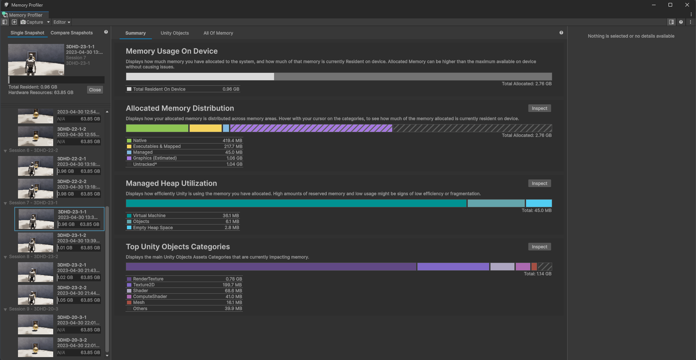

# Memory Profiler introduction

You can use the Memory Profiler to explore both native and managed memory allocations, and get a comprehensive understanding of your application's memory footprint. The Memory Profiler package complements the built-in [Memory Profiler module](xref:um-profiler-memory), and has a more detailed view of memory usage to support advanced debugging and optimization workflows.

To open the Memory Profiler window, go to  __Window__ &gt; __Analysis__ &gt; __Memory Profiler__.

 _The Memory Profiler window._

## Using the Memory Profiler

The Memory Profiler uses [snapshots](snapshots.md) to provide detailed information about memory usage at a specific point during the execution of your application. Snapshots include details about assets, GameObjects, textures, meshes, allocations, and other memory-related data.

Snapshots indicate how memory is allocated, grouped by various asset types such as textures, audio, meshes, and systems within Unity. A snapshot of memory can also help you identify areas of excessive memory usage or duplication of assets.

You can [compare two memory snapshots](snapshots-comparison.md) to identify changes in memory usage over time. This is especially useful for tracking memory consumption during certain events such as scene transitions or gameplay interactions.

## Memory Profiler workflows

Capture snapshots often and in a variety of circumstances. For example, don't rely entirely on a capture of your application running in the Editor or in Play mode. You'll always get the best data when you profile on a target platform.

Inspect your application's total memory use regularly to identify problems with memory use as soon as possible, such as if your application uses too much memory for the target platform.

Use the [All Of Memory](main-component.md#all-of-memory-tab) tab to view how much memory your application uses in total. This is useful if your application needs to meet a target size for memory use because you can see the exact total that your application uses.

For more information on Memory Profiler workflows, refer to [Inspect memory usage](inspect-memory-usage.md).

## How the Memory Profiler stores data captures

When you take a memory snapshot using the Memory Profiler UI or the [`MemoryProfiler` API](https://docs.unity3d.com/ScriptReference/Unity.Profiling.Memory.MemoryProfiler.html), the snapshot captures the entire contents of the managed heap for the Player or Editor instance at that specific moment. It also generates a report based on the memory that is tracked via Unity's Memory Manager and calls OS APIs to gather further metrics such as details about all allocated pages, which allows the Memory Profiler UI to show reliable information on how much memory is __Untracked__. When capturing Players or Editors based on Unity 2023.1 or newer, the data also includes metrics on which memory pages reside in physical memory and are therefore resident.

The Memory Profiler UI reads and analyses the data in the captured file so that it can be inspected by UI. For the Managed Memory metric it does so by reading the data of managed heap objects held via static fields or GCHandles (which includes all managed shells that still have a native object, which holds a GCHandle to its shell). It then follows the reference chain to all objects that are referenced in those fields until it has found all managed objects that would have been considered active at the time of capture.

The Memory Profiler doesn't collect information on references to managed objects that reside on the stack, nor does it find managed objects that would be collected in the next garbage collection pass.

The data used by collectible or collected managed objects doesn't get overridden until a new allocation is made on top of them, so the snapshot might contain more details in bytes that can't be read via the Memory Profiler UI. For more information, refer to [Safeguarding sensitive data](#safeguarding-sensitive-data).

The kind of data that you can explore in areas such as the __All of Memory Table__ and its category of __Managed > Managed Objects__ as well as the __Managed Fields__ section in the __Selection Details__ panel gives you an idea of what data could be included in the memory snapshot. The Memory Profiler includes any object instance of a class, all fields on that object, and the class' statics excluding literals such as `const` values.

The Memory Profiler stores fields depending on the data type:

* It stores [value types](https://docs.microsoft.com/en-us/dotnet/csharp/language-reference/keywords/value-types) by their value.
* It stores [reference types](https://docs.microsoft.com/en-us/dotnet/csharp/language-reference/keywords/reference-types) as pointer addresses. The __Managed Fields__ section in the _Selection Details__ panel resolves any pointer address to instead show the details of the referenced object or allocation, if it exists.

### Safeguarding sensitive data

The Memory Profiler stores data in a way that can make some sensitive data accessible. For example, string type fields might indicate via their name what the string they point to means. So searching for a field named `Password`, `Credentials` or `Token` might identify strings with sensitive data. If Unity has garbage collected the object that points to the string, or even the string itself, the data might still be there. However, it's no longer identifiable, unless you have a rough idea of what you're looking for or part of the string value to search for.

To prevent exposing sensitive information such as personal identifiers or credentials when sharing snapshots, you could store sensitive data in constant fields (`const`). The Memory Profiler doesn't capture constants because they are embedded into the binary executable. However, constant fields in the binary executable can be accessed through decompilation.

You can only take a memory snapshot in development Players, so these fields might be non-const in release builds, which makes it more difficult to get to the data, but not entirely impossible.

For further discussion about this issue, refer to the [Unity Discussions thread](https://discussions.unity.com/t/data-concerns-when-sharing-snapshots/752514).

## Additional resources

* [Collect memory data](snapshots.md)
* [Inspect memory usage](inspect-memory-usage.md)
