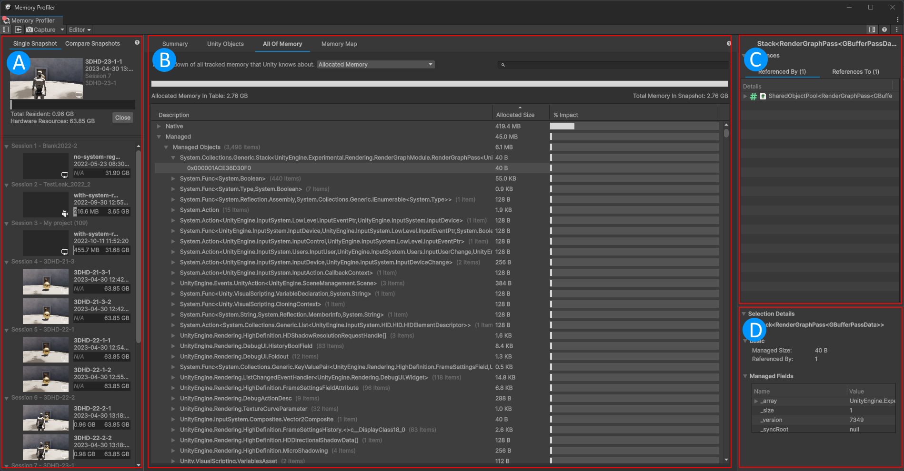

# Memory Profiler window reference

The Memory Profiler package operates in its own window in the Unity Editor.

To open the Memory Profiler window, go to  __Window__ &gt; __Analysis__ and select __Memory Profiler__.

The Memory Profiler window has the following panels:

 *The Memory Profiler window*

* [Snapshots panel](snapshots-component.md) (A): Contains all the memory snapshots in your project and allows you to compare snapshots.
* [Main panel](main-component.md)(B): Displays in-depth data about memory in a snapshot.
* [References panel](references-component.md)(C): Displays information about references to and from a selected object.
* [Selection Details panel](selection-details-component.md) (D): Displays detailed information about a selected object.

## Memory Profiler toolbar

You can use the toolbar at the top of the window to perform various actions. The control bar contains the following items:

|__Control__|__Function__|
|:---|:---|
|__Toggle Snapshots panel__| Expand or hide the [Snapshots panel](snapshots-component.md).|
|__Import__|Load a memory [snapshot](snapshots.md) from anywhere on your disk into the Memory captures folder specified in the Memory Profiler Preferences so that it gets listed in the Snapshots panel.|
|__Capture__| Select this button to take a memory snapshot. This operation might take a few seconds, depending on the size of your application. Once the Memory Profiler has captured the snapshot, it appears in the __Snapshots component__.  Select the dropdown menu to choose which flags the Memory Profiler captures:<ul><li>**Managed Objects**</li><li>**Native Objects**</li><li>**Native Allocations**</ul> Additionally, you can choose to include some additonal settings:<ul></li><li>**Screenshot**: Enable to capture a screenshot with every [snapshot](snapshots.md).</li><li>**Close open captures before capturing Editor**.</li><li>**Run Garbage Collection before capturing Editor**.</li></ul>|
|__Attach to Player__| Use the dropdown menu to choose a target to take a snapshot of. You can choose the Editor itself, any Player that's running, or manually enter the IP address of the device you want to take a memory snapshot on. For more information, refer to [Profiling your application](xref:um-profiler-profiling-applications).|

> [!NOTE]
> There is no clean separation between the memory used for Play mode and memory used for the Editor that runs in Play mode, so Editor snapshots always contain more memory and have a different memory usage behavior than a Player would, even if it runs on the same platform as the Editor. Taking Editor snapshots is therefore only recommended for faster iteration flows while optimizing, whereas the final result of optimization work should always be checked by analyzing the usage of a Player build.

## Additional resources

* [Snapshots panel reference](snapshots-component.md)
* [Main panel reference](main-component.md)
* [References panel reference](references-component.md)
* [Selection Details panel reference](selection-details-component.md)
