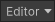
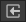

# Memory Profiler window controls reference

The __Memory Profiler__ package operates in its own window inside the Editor.

To open the Memory Profiler window, go to  __Window__ &gt; __Analysis__ and select __Memory Profiler__.

The Memory Profiler window has four components:

 *The Memory Profiler window*

__A__ The [Snapshots component](snapshots-component.md) contains all the memory snapshots in your Project and allows you to compare snapshots. 
__B__ The [Main component](main-component.md) displays in-depth data about memory in a snapshot. 
__C__ The [References component](references-component.md) displays information about references to and from a selected object. 
__D__ The [Selection Details component](selection-details-component.md) displays more detailed information about a selected object. 

Use the control bar at the top of the window to perform various actions in the Memory Profiler window.

The control bar contains the following items:

|__Control__|__Function__|
|:---|:---|
|__Toggle snapshots component__ | Expand or hide the snapshots component.
|__Attach to Player__ | Use the dropdown menu to choose a target to take a snapshot of. You can choose from Play mode, any Player that's running, the Editor itself, or manually enter the IP address of the device you want to take a memory snapshot on. For more information, see [Profiling your application](https://docs.unity3d.com/Documentation/Manual/profiler-profiling-applications.html).|
|__Capture__ | Select this button to take a memory snapshot. This operation might take a few seconds, depending on the size of your application. Once the Memory Profiler has captured the snapshot, it appears in the __Snapshots component__.  Select the dropdown arrow to open the __Choose Capture Flags__ dropdown menu. Use this menu to choose which flags the Memory Profiler captures.|
|__Import__ | Import a saved capture file.|
