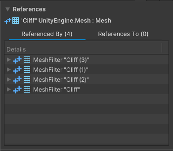

# References component

The __References__ component displays how objects reference each other in your snapshot. Use this component to see how the selected object is linked to other objects.

 The References component

The component has two tabs to display reference information:

* The __Referenced By__ tab shows the tree of references from the selected object.
* The __References To__ tab shows a list of objects that the selected object references.

The References component displays the selected object's name regardless of whether it contains any references. If a selected object does contain references or if another object references the selected object, then the component lists the references in the appropriate tab.

By default, the entries in the __Referenced By__ tab are collapsed and only show the root object. Select objects that belong to a hierarchy to expand them and see the full reference hierarchy of the object.

In the __References To__ tab, the component only displays all directly referenced objects but not the objects referenced by these.
