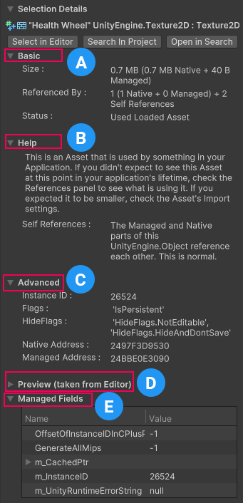

# Selection Details

This component displays detailed information about an item you select in either the [Main component](main-component.md) or the [References component](references-component.md). The contents of this component change dynamically based on the selected object.

 
The __Selection Details__ component

The __Selection Details__ component displays three buttons to interact with and multiple contextual data groups to describe the currently selected obeject. The three available buttons are:

* __Select in Editor__ - Select the object inside the Editor, if possible. This option is disabled for any objects that Unity generates at runtime.
* __Search In Project__ - Use Unity's legacy search to highlight the object in the project browser. For more information about the legacy search, see [Search in the Editor.](https://docs.unity3d.com/Manual/Searching.html)
* __Open in Search__ - Search for the object in the [Unity Search](https://docs.unity3d.com/Manual/search-overview.html) window.

Th Selection Details component also provides information about the object through the following data groups:

* A: [Basic](#basic) - displays high level information about any selected object.
* B: [MetaData](#metadata) - displays various detailed information about certain objects.
* C: [Help](#help) - displays text to explain the status of the object in more detail.
* D: [Advanced](#advanced) - displays more detailed information about the object than the Basic group. The Selection Details panel doesn't display this group for all types of objects.
* E: [Preview](#preview) - displays a preview of how an object appears in the Editor or your application e.g. Shaders.
* F: [Managed Fields](#managed-fields) - displays a table including any managed fields the selected object contains and information about those fields.

## Basic

This data group contains three entries:

* The __Size__ entry displays the size of the object in memory, and how much of that total is native or managed memory.
* The __Referenced By__ entry displays how many other objects reference the selected object and how many self-references the object has. The [References component](references-component.md) provides more details about these references.
* The __Status__ entry displays the type of object selected, whether or not it's used anywhere in the application and, if applicable, how it's used.

## MetaData

This group shows additional data specifics for supported objects. Current supported object types:

* Texture (eg. Texture2D, RenderTexture, Cubemap...)
* Mesh
* AudioClip
* Shader

## Help

This data group contains text to explain the __Status__ section of the [Basic](#basic) data group in more detail, and provide some insight into how to use this information. The text can consist only of a paragraph of text, or can include individual definitions for some terms, for example, explaining the meaning of the phrase "self-references", that might be used in other data groups.

## Advanced

This data group contains any of the following entries:

* Instance ID - the unique ID associated with this object in this snapshot.
* Flags - displays a list of active Flags on the object.
* HideFlags - displays a list of active HideFlags on the object.
* Native Address - the memory location where the native component of this object exists. Only visible on objects that use native memory.
* Managed Address - the memory location where the managed component of this object exists. Only visible on objects that use managed memory.

## Preview

This data group displays a preview of how some objects appear in the application or Editor. This group is only visible for the following object types:

* Shaders
* Meshes
* Textures
* Materials
* Audio clips

## Managed Fields

This data group displays a table containing any fields in managed memory that the selected object contains. Some entries might involve hierarchies; select the parent entry to expand or hide sub-entries. The table displays the following columns:

* Name - the name of the field.
* Value - the current value of the field when the snapshot was captured.
* Type - the data type of the field.
* Size - the amount of memory the field used when the snapshot was captured.
* Notes - any additional or supplementary information relevant to the field.
