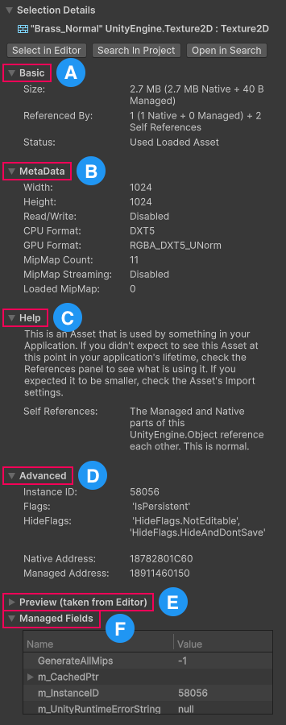

# Selection Details panel reference

When you select an object, the Memory Profiler displays detailed information about that object in the **Selection Details** section, located in the right-hand panel of the window. The contents of this component change dynamically based on the selected object.

 _The Selection Details panel._

Th Selection Details section provides information about the object through the following data groups:

* [Basic](#basic) (A): Displays high level information about any selected object.
* [MetaData](#metadata) (B): Displays various detailed information about certain objects, such as importer settings that affect its memory usage.
* [Help](#help) (C): Displays text to explain the status of the object in more detail.
* [Advanced](#advanced) (D): Displays more detailed information about the object than the Basic group. The Selection Details panel doesn't display this group for all types of objects.
* [Preview](#preview) (E): Displays a preview of how an object appears in the Editor or your application.
* [Managed Fields](#managed-fields) (F): Displays a table including any managed fields the selected object contains and information about those fields.

## Contextualize the object

At the top of the section, under the selected object name, there are buttons to interact with and contextualize the selected object, as follows:

|**Button**|**Description**|
|---|---|
|__Select in Editor__| Select the object inside the Editor, if possible. This option is disabled for any objects that Unity generates at runtime or that the Memory Profiler could not find in the current project based on the information present in the snapshot.|
|__Search In Project__| Highlight the object in the project browser. For more information, refer to [Search in the Editor.](xref:um-searching)|
|__Open in Search__| Search for the object in the [Unity Search](xref:um-search-overview) window.|

## Basic

The Basic information section contains the following information:

|**Information**|**Description**|
|---|---|
| __Size__| The size of the object in memory, and how much of that total is native, managed or graphics memory.|
|__Referenced By__| How many other objects reference the selected object and how many self-references the object has. The [References panel](references-component.md) provides more details about these references.|
|__Status__| The type of object selected, whether it's used anywhere in the application, and how it's used.|

## MetaData

Displays additional data specifics for supported objects. Current supported object types:

* Texture
* Mesh
* AudioClip
* Shader

## Help

Contains text to explain the __Status__ section of the [Basic](#basic) data group in more detail, and provides insight into how to use this information. The text can consist only of a paragraph of text, or can include individual definitions for some terms.

## Advanced

Contains any of the following information:

| **Information**         | **Description**                                                                 |
|--------------------|---------------------------------------------------------------------------------|
| **Instance ID**        | The unique ID associated with this object in this snapshot.                    |
| **Flags**              | Displays a list of active Flags on the object.                                 |
| **HideFlags**          | Displays a list of active HideFlags on the object.                             |
| **Native Address**     | The memory location where the native component of this object exists. Only visible on objects that use native memory. |
| **Managed Address**    | The memory location where the managed component of this object exists. Only visible on objects that use managed memory. |

## Preview

Displays a preview of how some objects appear in the application or the Unity Editor. The preview relies on information from the currently open project and searching for the object based on data in the capture. When looking at Editor captures made in the same session, it is highly reliable as it can find the object base on the instance ID of the object, meaning it can even find runtime created assets such as `RenderTextures` used by cameras and visual effects if they are still held in memory. In all other cases, it uses the object's name and type to search the project using the Editor's [search feature](xref:um-search-overview). A preview is only shown if that search results in exactly one match.

This group is only visible for the following object types:

* Shaders
* Meshes
* Textures
* Materials
* Audio clips

## Managed Fields

Displays a table that contains any fields in [managed memory](xref:um-performance-managed-memory-introduction) that the selected object contains. Some entries might involve hierarchy levels showing the fields of other managed objects or structs held by these fields. The table displays the following information:

| **Column** | **Description**                                                                 |
|------------|---------------------------------------------------------------------------------|
| **Name**   | The name of the field.                                                         |
| **Value**  | The current value of the field when the snapshot was captured.                 |
| **Type**   | The data type of the field.                                                    |
| **Size**   | The amount of memory the field used when the snapshot was captured. For elements deeper than the first level of the hierarchy, this might show the size of a managed object or native allocation referenced by the field, rather than the size of a field belonging to the selected object itself.           |
| **Notes**  | Any additional or supplementary information relevant to the field.             |

## Additional resources

* [Snapshots panel reference](snapshots-component.md)
* [Main panel reference](main-component.md)
* [References panel reference](references-component.md)
