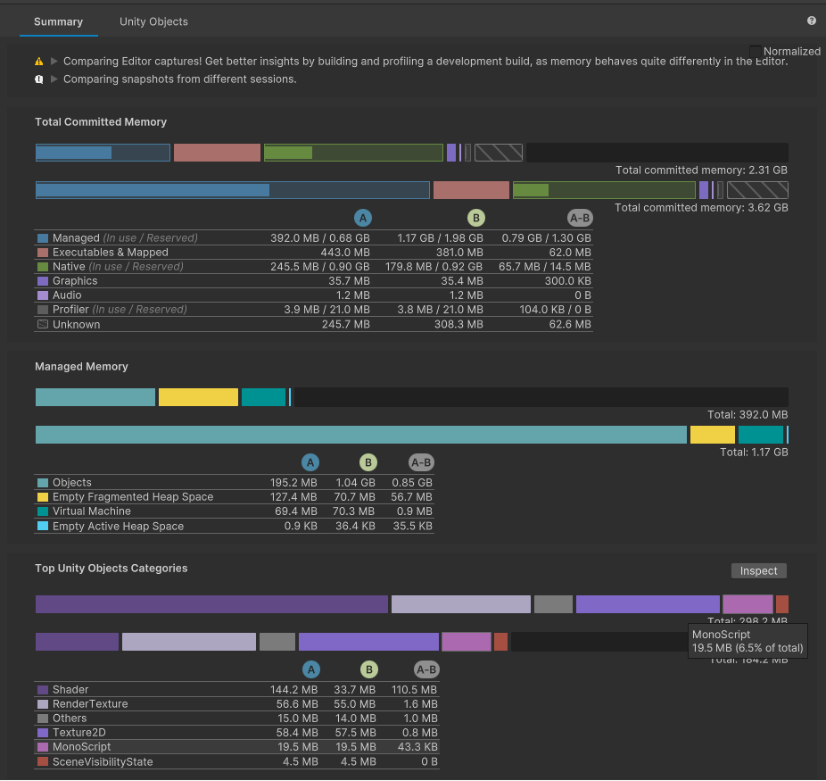
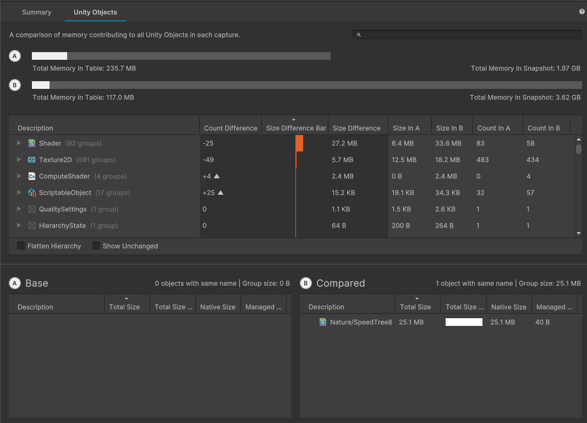
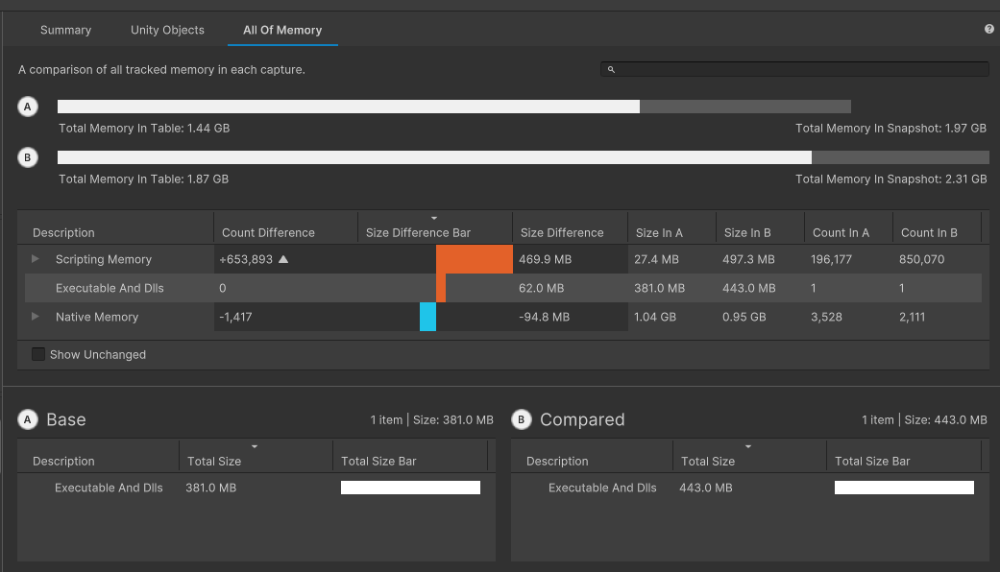

# Compare two snapshots

You can use the __Compare Snapshots__ mode in the [Snapshots component](snapshots-component.md) to compare two snapshots together. When you enable this mode, select any two snapshots to open them both in a comparison view in the [Main component](main-component.md).

Make sure to read any tips in the tips section when you compare snapshots. This is important because variations in snapshots, such as taking snapshots from different sessions, can lead to variations from factors not related to your applications.

In the [Summary comparison](#summary-comparison), select any table entry or segment of a bar to display it in detail in the [Selection Details component](selection-details-component.md).

For the [Unity Objects comparison](#unity-objects-comparison) and [All Of Memory comparison](#all-of-memory-comparison), you can customize the data that the tables display.

By default, the tables don't display any data that's identical in both snapshots. To display matching data in the displays, enable the __Show Unchanged__ checkbox.

To sort the tables by a particular column, click on the column name in the table. When you click on the column the table is currently sorted by, this toggles between ascending and descending order. Click on a different column name to sort by that column instead. You can only sort by one column at a time.

To enable or disable columns, right-click on any column name to open the column sub-menu. Click on any active column name in the menu to hide the column, or click on any hidden column to display it. You can't hide the __Description__ column; all other columns are enabled by default.

Select any non-parented entry to open that entry in the direct comparison tables underneath the primary table, and in the [Selection Details component](selection-details-component.md), if any details are available.

## Summary comparison

In this tab, each of the __Memory Usage On Device__, __Allocated Memory Distribution__, __Managed Heap Utilization__ and __Top Unity Objects Categories__ sections contains two sets of information - two bars to visually display the memory used in each snapshot, and a table to compare the absolute values for the used memory.

Hover your cursor over any element in either of the bars or over any entry in the table too see exactly how much memory that entry uses, and the percentage of both the reserved and total memory that it represents.

The first bar in the tab represents the first snapshot you selected, with the other bar being the second snapshot.

In the table, the first two columns are the memory usage values for each snapshot and the third column displays the absolute difference between those two values for that row.

Select another snapshot from the [Snapshots Component](snapshots-component.md) to replace the least recently selected snapshot. Alternatively, select the __Close__ button next to an entry in the __Open Snapshots Pane__ to close that snapshot. You can then select another to take its place.

## Unity Objects comparison

This tab compares the memory usage of any Unity Objects in the two selected snapshots.

The table in this tab displays the absolute values for both snapshots and the difference between them. You can use the difference to, for example, test optimizations - if you compress a Texture2D object to save some memory, you can compare a snapshot from before and after the change to make sure that it saved the expected amount of memory.

This tab displays information about specific Unity Objects, so can contain a huge number of possible entries. To improve readability the table groups similar Unity Objects, such as Shaders, together into parented row entries by default. Expand the parent entry to see individual Unity Object entries. Enable the __Flatten Hierarchy__ checkbox to only show individual row entries.

## All Of Memory comparison

Use this tab to evaluate how the total memory use in your application changes over time. Compare more recent snapshots to earlier ones to see how changes you make to your application can affect the total memory use. Be aware that taking snapshots in different sessions might not provide completely accurate comparisons - for example, other executables running on your machine can change the total memory use that this tab displays. If you need to compare snapshots from different sessions, try to keep as many conditions the same as possible when you record the snapshots.

