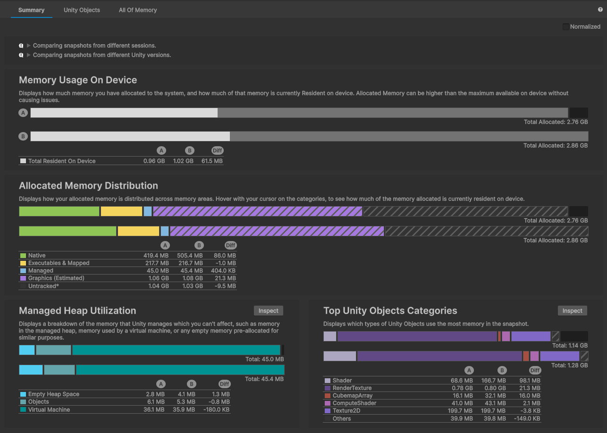

# Compare two snapshots

Use the __Compare Snapshots__ tab in the [Snapshots panel](snapshots-component.md) to compare two snapshots together. When you select the Compare Snapshots tab, you can select any two snapshots to open them both in a comparison view in the [Main component](main-component.md).

Make sure to read any tips in the tips section when you compare snapshots. This is important because variations in snapshots, such as taking snapshots from different sessions, can lead to variations from factors not related to your applications.

When you compare two snapshots, the information displayed in the [Memory Profiler window](memory-profiler-window-reference.md) adjusts so you can compare the data sets side by side:

* The [Summary comparison](#summary-comparison-tab) displays any table entry or segment of a bar in detail in the [Selection Details panel](selection-details-component.md).
* Use the [Unity Objects comparison](#unity-objects-comparison-tab) and [All Of Memory comparison](#all-of-memory-comparison-tab) to customize the data that the tables display.

By default, the tables don't display any data that's identical in both snapshots. To display matching data in the displays, enable the __Show Unchanged__ checkbox in the Unity Objects or All Of Memory tabs.

## Summary comparison tab

In this tab, each of the __Memory Usage On Device__, __Allocated Memory Distribution__, __Managed Heap Utilization__ and __Top Unity Objects Categories__ sections contains two sets of information: two bars to visually display the memory used in each snapshot, and a table to compare the values for the used memory, showing positive numbers if the value is bigger in (B) and negative ones if it is bigger in (A).

Hover over any element in either of the bars, or over any entry in the table to determine exactly how much memory that entry uses, and the percentage of both the reserved and total memory that it represents.

The first bar in the tab represents the first snapshot you selected (A), with the other bar being the second snapshot (B).

In the table, the first two columns are the memory usage values for each snapshot and the third column displays the difference between those two values for that row.

## Unity Objects comparison tab

This tab compares the memory usage of any Unity objects in the two selected snapshots.

The table displays the absolute values for both snapshots and the difference between them. You can use the difference to test optimizations. For example, if you compress a Texture2D object to save some memory, you can compare a snapshot to make sure that the change saved the expected amount of memory.

This tab displays information about specific Unity objects, so it might contain a huge number of possible entries. To improve readability the table groups similar Unity objects, together into parented row entries by default. Enable the __Flatten Hierarchy__ checkbox to only show individual row entries.

## All Of Memory comparison tab

Use this tab to evaluate how the total memory use in your application changes over time. Compare more recent snapshots to earlier ones to discover how changes you make to your application can affect the total memory use.

Taking snapshots in different sessions might not provide completely accurate comparisons. For example, other executables running on your machine can indirectly change the total memory use that this tab displays. If you need to compare snapshots from different sessions, try to keep as many conditions the same as possible when you record the snapshots.

## Additional resources

* [Snapshots panel](snapshots-component.md)
* [Capture and import snapshots](snapshot-capture.md)
