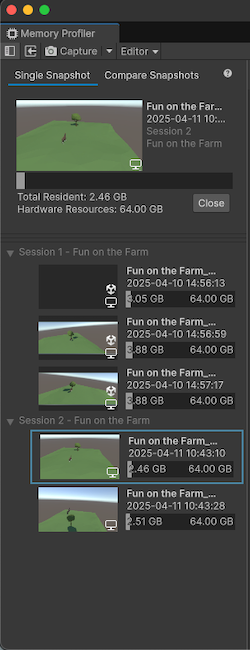

# Snapshots panel reference

The left panel of the [Memory Profiler window](memory-profiler-window-reference.md) is the Snapshots panel. The Snapshots panel displays a list of [memory snapshots](snapshots.md) in your project. You can select an individual snapshot for analysis, or compare any two snapshots. The Memory Profiler package can capture snapshots of the Unity Editor or of a running Player.

 _The Snapshots panel with a single snapshot selected._

The Snapshots panel displays a list of all snapshots saved to or loaded into your project. It has the following modes:

* **Single Snapshot**: Display information about a single snapshot in the Memory Profiler window.
* **Compare Snapshots**: Select two snapshots [to compare data](snapshots-comparison.md). The Memory Profiler window then displays the differences between the two snapshots' data.

## Open snapshots

The area at the top of the Snapshots panel displays the currently selected snapshot or snapshots. By default, the __Single Snapshot__ mode is active, which enables you to view one snapshot at a time. Select the __Compare Snapshots__ mode to choose two snapshots to compare to each other. When in __Compare Snapshots__ mode, Unity keeps both snapshots in active memory to minimize the time needed to switch between them. For more information, refer to [Compare two snapshots](snapshots-comparison.md).

## Snapshot list

Each snapshot in the list contains the following information:

|**Information**|**Description**|
|---|---|
|**Screenshot**|A screenshot of the target during capture. Editor-only snapshots don't include a screenshot. If you don't want to include a screenshot with a snapshot, select the **Capture** dropdown, and disable the **Snapshot** setting.|
|**Product name**|The product name, set in **Project Settings** &gt; **Player** &gt; **Product Name**.|
|**Time and date**|The time and date that the snapshot was captured. Unity stores the date on each snapshot in Universal Coordinated Time (UTC) format and converts it to your computer's local time.|
|**Memory overview**|Displays the total resident memory as a portion of the maximum amount of memory available.|

## Snapshot contextual information

Whenever you hover over a snapshot, the following information is displayed in a contextual box:

|**Information**|**Description**|
|---|---|
|**Snapshot name**|The file name of the snapshot.|
|**Platform**|The platform the snapshot was captured on.|
|**Scripting backend**|The Unity [scripting backend](xref:um-scripting-backends) of the project.|
|**Unity version**|The version of the Unity Editor used to capture the snapshot.|
|**Metadata Description**|A customizable string value provided at runtime via the [MetadataCollect API](xref:Unity.MemoryProfiler.MetadataCollect). By default this entails the Project name, the time at which the runtime begun taking the snapshot, the frame count as the capture was taken, and the time since the startup of the application and optionally when the Editor entered Play mode. You can use the [MetadataCollect API](xref:Unity.MemoryProfiler.MetadataCollect) to provide other context information such as the current level.|
|**Memory data**|Displays the maximum amount of memory available, the total resident memory, and the total allocated memory.|

## Additional resources

* [Main panel reference](main-component.md)
* [References panel reference](references-component.md)
* [Selection Details panel reference](selection-details-component.md)
