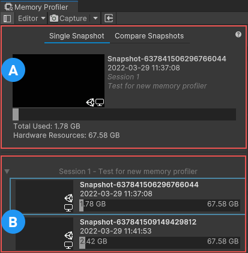
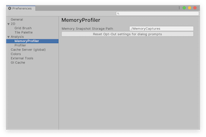

# Snapshots component

The Snapshots component displays a list of memory snapshots in your project. You can select an individual snapshot for analysis, or compare any two snapshots. The Memory Profiler package can capture snapshots of the Unity Editor or of a running Player.

> [!NOTE]
> Editor-only snapshots don't include a screenshot.

A - [Open Snapshots Pane](#open-snapshots-pane) 
B - List of available snapshots 

Each snapshot in the list displays a screenshot of the profiling target during the capture, a default name, and the time and date of the capture. If there are snapshots in the list from more than one session, Unity sorts them into logical groups, which you can click on to expand or collapse them.

Unity stores the date on each snapshot in Universal Coordinated Time (UTC) format and converts it to your computer's local time. Hover your cursor over the date to see which Project the snapshot is from.

## Path to captured snapshots

When you create a snapshot for the first time, Unity creates a sub-folder in your Project folder called `MemoryCaptures`. By default, the Memory Profiler stores all snapshots in this folder.

To change the default storage path for the snapshots, go to __Edit__ &gt; __Preferences__ &gt; __Analysis__ &gt; __MemoryProfiler__ and edit the __Memory Snapshot Storage Path__ property. The default value is "MemoryCapture".

The path in this property is relative, which means it must start with:

* "./" if the `MemoryCaptures` folder is within the Project folder
* "../" if the `MemoryCaptures` folder is one level above the `Project` folder in the hierarchy.

   *Memory Profiler Preferences*

## Open Snapshots pane

The __Open Snapshots__ pane displays the currently selected snapshot or snapshots. By default, the __Single Snapshot__ mode is active, which enables you to view one snapshot at a time. Select the __Compare Snapshots__ mode to choose two snapshots to compare to each other. When in __Compare Snapshots__ mode, Unity keeps both snapshots in active memory to minimize the time needed to switch between them. For more information, see [Compare two snapshots](snapshots-comparison.md).

Unity displays details about any selected snapshot in the __Open Snapshots__ pane, including:

* The screenshot associated with the snapshot
* The snapshot's name
* The time and date of capture
* The session you captured it in
* The project you used to capture it
* Icons to identify the platform and application you used to capture it (whether in the Editor or a Player)
* The total memory used by your application during the snapshot, and the total resources available at the time
