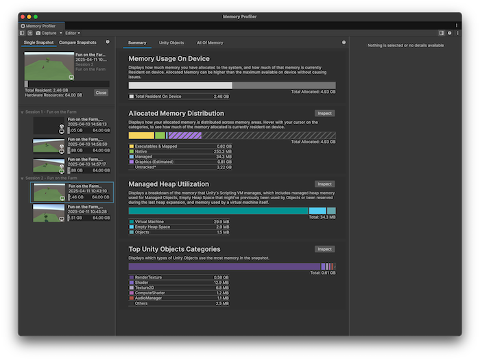

# Snapshots introduction

A memory snapshot is a record of how the memory in your application was organized at the point in a frame when the snapshot was taken.

 *The Memory Profiler with snapshots of data in the left Snapshots panel. A selected snapshot's memory data is displayed in the Summary panel.*

Use the [Snapshots panel](snapshots-component.md) in the Memory Profiler window to capture, load, and analyze snapshots. For more information, refer to [Capture and import snapshots](snapshot-capture.md).

You can take multiple snapshots during an application's execution but this isn't the same as constant monitoring. If you need to profile how memory use in your application changes in real-time during execution, use the [Memory Profiler module](xref:um-profiler-memory) in the built-in [Profiler](xref:um-profiler).

## Snapshot files

When you create a snapshot for the first time, Unity creates a subfolder in your project folder called `MemoryCaptures`. By default, the Memory Profiler stores all snapshots in this folder. It saves each snapshot with the `.snap` extension.

> [!TIP]
> Add the .snap extension to your version control system's [ignore file](https://www.atlassian.com/git/tutorials/saving-changes/gitignore) to avoid committing memory snapshot files to your repository. Memory snapshot files might use large amounts of disk space.

To change the default storage path for the snapshots, go to __Edit__ &gt; __Preferences__ &gt; __Analysis__ &gt; __MemoryProfiler__ and edit the __Memory Snapshot Storage Path__ property.

The path in this property is relative, which means it must start with:

* `./` if the `MemoryCaptures` folder is within the Project folder
* `../` if the `MemoryCaptures` folder is one level above the `Project` folder in the hierarchy.

## Snapshot metadata

You can use the [`MetadataCollect`](xref:Unity.MemoryProfiler.MetadataCollect) API to add metadata to player or Editor captures. This information appears when you hover over a snapshot in the [snapshot panel](snapshots-component.md#snapshot-contextual-information).

 *The Memory Profiler with snapshots of data in the left Snapshots panel. The tooltip for a selected snapshot displays custom metadata about the level the data was captured from.*

## Additional resources

* [Capture and import snapshots](snapshot-capture.md)
* [Snapshots panel reference](snapshots-component.md)
* [Memory Profiler module](xref:um-profiler-memory)
