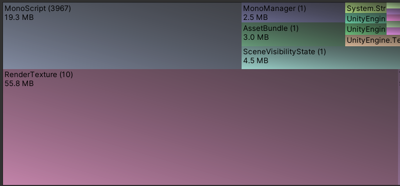
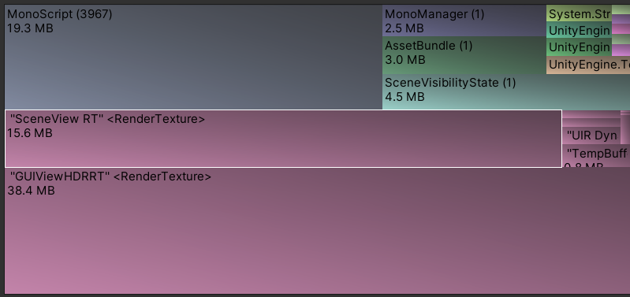

# Summary view

This view displays general information about the state of memory in the selected snapshot. You can investigate the information the Summary view displays in more detail in the other available views. The Summary view contains the following four sections:

* The [Memory Usage Overview](#memory-usage-overview) describes how each type of memory is allocated, compared to the total memory used in the snapshot.
* The [Tree map](#tree-map) displays the relative size of each individual object in memory.
* The [Objects filter table](#objects-filter-table) lists all objects in memory with filters to sort them.
* [Top Issues](#top-issues) displays warnings and errors you might have with the snapshot.

## Memory Usage Overview

This view displays information about how the total memory allocated during the snapshot is split between the different types of memory. You can select any element in this view to see more detailed information about it in the [Selection Details](selection-details) view.

The Memory Usage Overview displays the data in two sections:

* The Memory Usage section displays how the tracked memory in the snapshot is divided between the different types of available memory.
* The Total Committed Memory Tracking Status section displays how much of the total memory used when Unity captured the snapshot was tracked and untracked.
* The Managed Memory section displays a breakdown of the memory that Unity manages which you can't affect, such as memory in the managed heap, memory used by a virtual machine, or any empty memory pre-allocated for similar purposes.

## Tree map

The nodes in this section are a visual representation of the proportion of memory that each object in memory used at the time Unity captured the snapshot. You can navigate this section with your cursor; scroll the scroll wheel to zoom in or out, and click and drag the middle mouse button to pan around the view.

The number next to each node's name indicates the number of sub-nodes related to that object. Select the object to expand it and show any sub-nodes it contains. You can then select the sub-nodes to see more detail about them in the [Selection Details](selection-details.md) panel. For example, the screenshot below shows RenderTexture (10), which indicates that there are ten sub-nodes for this RenderTexture object.

The below screenshot shows the same RenderTexture after it's been selected and expanded:

## Objects filter table

This section lists all objects represented in memory when Unity captured the snapshot. Each entry in this table represents a single object in memory.

You can use filters to change how many objects this table displays and how it's organized. To access filters, select the name of each column to open a sub-menu containing the filters. You can set filters on each column individually to precisely control the information the table displays.

## Top Issues

This section contains an exhaustive list of any issues the snapshot might have. For example, if you capture an Editor snapshot, this section displays a warning about how to separate your application's memory profile from the Editor's profile.
