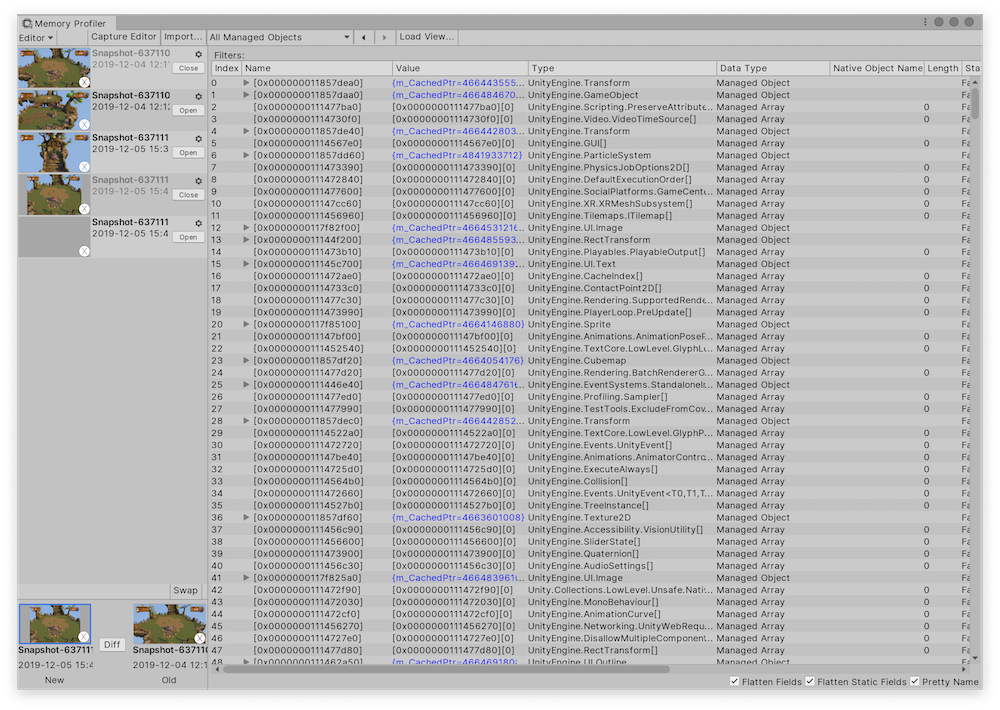
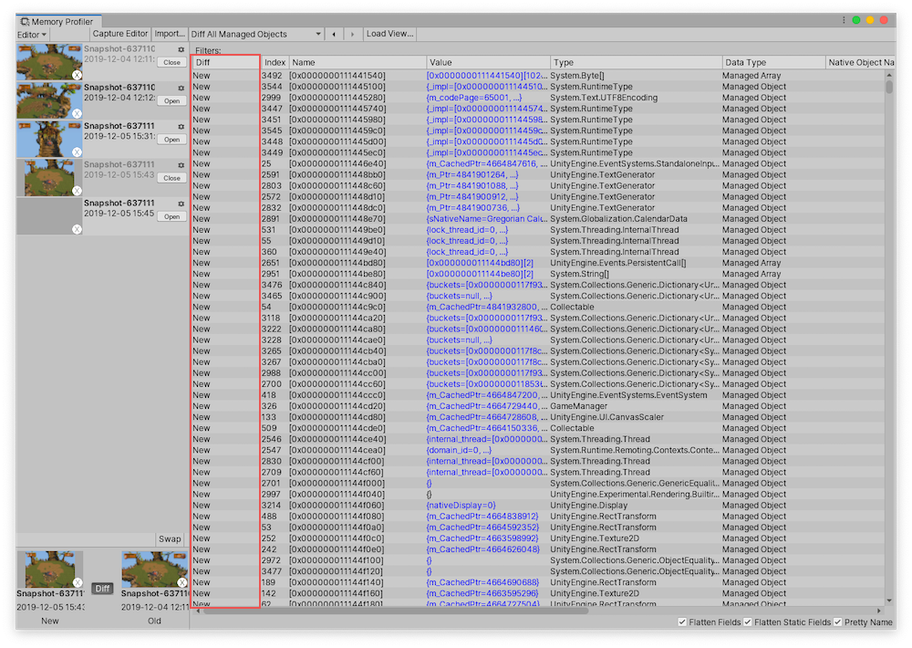

# Table view

The table view mode displays all crawled snapshot data in a table format. You can use this view to process the data with filters (sort, group, match) and extract relevant information. Use the dropdown __View__ menu at the top of the Main view to select from the following tables:

* __Raw Data__: Select from a list of raw data to view.
* __All Managed Objects__: a collection of all managed objects (IL2CPP or Mono) in the memory snapshot.
* __All Native Objects__: a collection of all native objects of types that inherit the `Unity.Object` in the memory snapshot.
* __All Objects__: a collection of all objects (native and managed) in the snapshot.
* __Alloc__: Select from a list of allocations to view.

 *Table view, displaying All Managed Objects*

## Table columns

The following is an overview of what each column means:

|**Column**|**Description**|
|:---|:---|
| __Index__ | The index of the object's entry in the __All Objects__ table.  |
| __Name__ | Displays an object's address in the memory. For variables, this column displays the name of the variable. |
| __Value__ | Highlights objects with variables in blue, and you can select the entry to see further information on this object. For objects without variables, this column displays the address in the memory (the same as the __Name__ column). For variables, it displays the value of the variable. |
| __Type__ | Displays the class of the object or variable. |
| __Data Type__ | Displays what data type of the object from one of the following values: __Managed Array__ (Mono/IL2CPP array), __Managed Object__ (Mono/IL2CPP object), or __Native Object__ (C++ object) |
| __Native Object Name__ | Displays the name of the native object, otherwise this field is empty. |
| __Length__ | Displays the number of elements in a managed array's collection, otherwise this field is empty.|
| __Static__ | Displays __True__ if the field is static, otherwise displays __False__. |
| __RefCount__ | Displays the count of other objects that reference this object. |
| __Owned Size__ | Displays the size of the managed type of a managed object. For managed references, this column displays the size of the pointer, and for native objects it displays the size of the object. In all other cases it displays 0.|
| __Target Size__ | Displays the size of a static value's type. For managed references, this column displays the size of the referenced object, and for native references, it displays the size of the referenced object. In all other cases, it displays 0. |
| __Native Size__ | Displays the size of the native object, otherwise this field is empty. |
| __Native Instance ID__ | Displays the ID of the corresponding native object for a managed object. Otherwise, this field is empty.|
| __Address__ | Displays the object's address in the memory. |
| __Unique String__ | An internal entry used for comparison of objects. |

### Diff tables

When you inspect the __Diff__ of two snapshots, all of the tables are available as diff tables. The Diff tables, such as __Diff All Objects__, __Diff All Managed Objects__, and __Diff All Native Objects__, are the same as the corresponding tables. The key difference is that they contain a __Diff__ column, as shown below. For each object in the table, the Diff displays whether the object is either __Same__, __New__, or __Deleted__.

The Memory Profiler also labels the snapshot with the older timestamp as __Old__ and the snapshot with the most recent timestamp as __New__. This makes it easier to determine which snapshot is being compared.

 *All Objects Diff table view, with Diff column highlighted*

## Filter tables

To filter the data in the columns, select the header of the column you want to sort by and you can choose from:

* __Group:__ Groups all objects together that have a matching value. You can apply this filter to multiple columns. When you filter this way, each group contains the count of the number of objects in brackets. Select the group to expand it.
* __Sort Ascending:__ Sort the values from lowest to highest.
* __Sort Descending:__ Sort the values from highest to lowest.
* __Match__: Adds a text field that you can use to enter a value to search for a match or a string contained in the column. 

When you add a filter to the table, it appears above the table. To remove a filter, select the __X__ button next to it. The filters apply in order from left to right (oldest to newest). Click on groups that have a group filter applied to expand the group.

 *Filter options at the top of the table view*