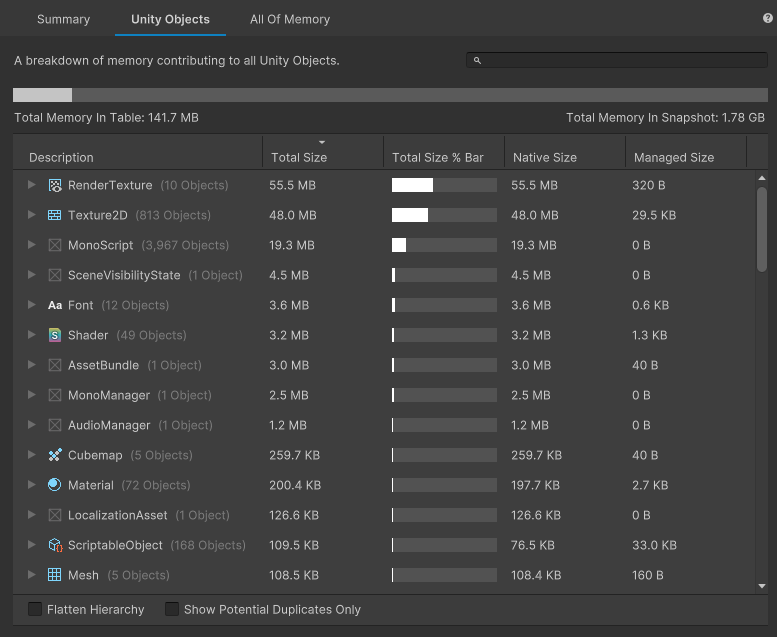

# Unity Objects tab

The __Unity Objects__ tab displays any Unity objects that allocated memory, how much native and managed memory that the object uses, and the combined total. Use this information to identify areas where you can eliminate duplicate memory entries or to find which objects use the most memory. Use the search bar to find the entries in the table which contain the text you enter.

 The Unity Objects tab

> [!NOTE]
> The search bar can only search for the text shown in the Description column. This will be changed to include other search functionality in future updates.

The following table describes each of the available columns in the table:

|__Column__|__Description__|
|:---|:---|
|__Description__| Displays the name of each individual object or group of objects. Can't be disabled. |
|__Allocated Size__| Displays how much memory the object or group of objects allocated, in bytes. |
|__Resident Size__| Displays how much memory the object or group of objects is resident, in bytes. |
|__% Impact__| Displays how much memory the object or group of objects uses as a percentage of the __Allocated Memory In Table__ value. All measurement bars, including the __Allocated Memory In Table__ bar, adjust dynamically based on the selected object in the table. |
|__Native Size__| Displays how much of the __Allocated Size__ value is made up of native memory. |
|__Managed Size__| Displays how much of the __Allocated Size__ value is made up of managed memory. |
|__Graphics Size__| Displays how much of the __Allocated Size__ value is made up of graphics memory. |

By default, the table lists all relevant objects by __Allocated Size__ in descending order. You can click on a column header name to sort the table by that column or to change whether the column sorts in ascending or descending order. Hold Ctrl (macOS: Cmd) when you click on a column name to add it to an existing sort. For example, to sort by both __Description__ and __Allocated Size__, click on the __Description__ header, then hold Ctrl or Cmd and click on the __Allocated Size__ header.

You can continue to hold Ctrl/Cmd and select the header again to toggle between ascending and descending for each individual sorted column. You can sort by any number of columns and in any order - Unity displays a number in each column header to display the sort order, alongside the arrow which indicates whether the Memory Profiler sorts that column in ascending or descending order.

To hide a column, or to display a hidden column, right click on any column header name and select a name from the sub-menu to hide or display that column. You can hide any column except the __Description__ column, which is always visible.

## Table mode
Use Table Mode dropdown to see Allocated, Resident Memory usage of allocations, and their relative impact on the total usage. The dropdown changes the memory columns the table displays:
* __Allocated Memory__ - shows only Allocated memory, __% Impact__ is shown against __Allocated Memory In Table__
* __Resident Memory on Device__ - shows only Resident memory, __% Impact__ is shown against __Resident Memory In Table__
* __Allocated and Resident Memory on Device__ - shows Allocated and Resident memory, __% Impact__ is shown against __Allocated Memory In Table__

For more information on the Resident Memory see [Memory Usage On Device](memory-on-device.md).

## Modifier toggles

There are two toggles you can use to change which entries the table displays, which are both disabled by default:

* Enable the __Flatten Hierarchy__ toggle to expand all objects into single entries instead of collapsible groups.
* Enable the __Show Potential Duplicates Only__ toggle to only display instances where objects might be separate instances of the same object.

The __Show Potential Duplicates Only__ toggle populates the table with information about duplicated memory use. When you enable this toggle, the Memory Profiler window groups any objects in the table with the same name, size, and type together. You can then look through the list to separate any similar objects that should be independent from those that are two instances of the same object.
