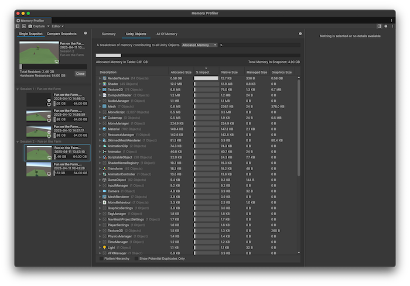

# Unity Objects tab

The **Unity Objects** tab shows any Unity objects that use memory and displays how much native and managed memory that the object uses, as well as the combined total. Use this information to identify areas where you can eliminate duplicate memory entries or to find which objects use the most memory. Use the search bar to find entries in the table which contain the text you enter.

> [!NOTE]
> The search bar can only search for items that contain text in the target object's name. This will be changed to include other search functionality in future updates.

By default, the table lists all relevant objects by **Total Size** in descending order. You can click on a column header name to sort the table by that column or to change whether the column sorts in ascending or descending order.

To hide a column, or to show a hidden column, right click on any column header name and select a name from the sub-menu to hide or show that column. You can hide any column except the **Description** column, which is always visible.

The **Total Size % Bar** column displays the data as a percentage of the **Total Memory In Table** value. All measurement bars, including the **Total Memory In table** bar, adjust dynamically based on the select object in the table.

 *The Unity Objects tab*

## Modifier toggles

There are two toggles you can use to change which entries the table displays, which are both disabled by default:

* Enable the **Flatten Hierarchy** toggle to expand all objects into single entries instead of collapsible groups.
* Enable the **Show Potential Duplicates Only** toggle to only show instances where objects might be separate instances of the same object.

The **Show Potential Duplicates Only** toggle populates the table with information about duplicated memory use. When this toggle is enabled, the Memory Profiler window groups any objects in the table with the same name, size, and type together. You can then look through the list to separate any similar objects that should be independent from those that are two instances of the same object.
