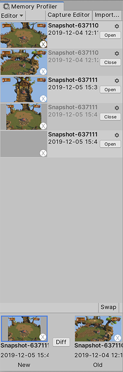

# Workbench

The Workbench is the panel on the left side of the Memory Profiler window. It contains all the memory snapshots that are part of your Project. 

 *The Memory Profiler Workbench*

The Workbench displays a screenshot of each snapshot from the moment of capture, its name, plus the date and time of the capture. **Note:** Snapshots of the Editor-only do not have a screenshot.

Unity stores the date on each snapshot in UTC format but converts it to your computer's local time. If you hover over the date, Unity displays the Project the snapshot is from. If you hover over the file name, Unity displays the location of the snapshot file on your computer. 

In addition to this information, the Memory Profiler also overlays the logo of the platform you took the snapshot on, for quick reference. 

Select the cog icon in the top right of each snapshot entry to delete or rename the snapshot file, or open the containing folder for the snapshot file. **Note:** To rename or delete a snapshot, you must close it first.

## Opening snapshots

To open a snapshot and view its data, select the __Open__ button to the right of the snapshot. This operation might take a moment, depending on the size of the snapshot, because Unity needs to process it for display. [The Main view](main-view) then displays different visualizations of the snapshot data.

When you open a snapshot, the Memory Profiler grays out its name and date, and the __Open__ button changes to a __Close__ button, which you can then use to close the snapshot when you finish using it. 

## Open Snapshots pane

Below the list of snapshots in the Workbench, is the **Open Snapshots pane** which displays the snapshots you have open. This area allows you to compare two snapshots, and Unity keeps them in memory so you can quickly switch between the two to compare data.

When you select the __Open__ button on a snapshot, it appears in the left box in the __Open Snapshots pane__. If you then select the __Open__ button on another snapshot, the original snapshot shifts to the right box, and the newly opened snapshot appears in the left.

Subsequently, when you open another snapshot, the Memory Profiler closes the snapshot in the right box, shifts the open snapshot in the left box to the right box, and then opens the new snapshot in the left box. If you want to keep the snapshot in the right box to compare to a new snapshot, select the __Swap__ button in the top right of the __Open Snapshots pane__, and the Memory Profiler swaps the order of the open snapshots.

When you click on one of the snapshots, the Memory Profiler outlines it in blue and displays its memory information in the [Main view](main-view).

### Diff snapshots

When you have two snapshots open, you can select the __Diff__ button to display the difference between the two snapshots. The first time you use this function, it takes a moment for the Memory Profiler to process and generate the data for the diff view. Once the Memory Profiler generates the diff, you can switch to the diff view instantly.

When you close one of the two snapshots, or open a new snapshot, the Memory Profiler unloads the diff data.