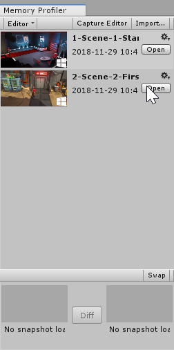
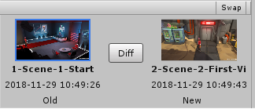
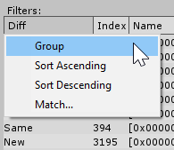

# How to find memory leaks

If you find a memory leak in your application, it might slow it down and ultimately lead to crashes.

Memory leaks typically happen because of one of two issues:
* An object is not released manually from memory through the code.
* An object stays in memory because of an unintentional reference.

You can use the Memory Profiler to track down these leaks in both managed and native memory.

This workflow example describes how to capture multiple memory snapshots over a specific timeframe and compare them inside the Memory Profiler window with the __Diff__ mode.

For more information, see [Workbench Diff snapshots](workbench.md#diff-snapshots).

## Find and fix memory leaks that happen after Scene unload

There are multiple ways that memory leaks happen. A common way is when resources, or user allocated objects, are not cleaned up after unloading a __Scene__. The following steps outline the basic workflow to attempt to identify such issues.

1. Attach the Memory Profiler to the running Player. For information on how to do this see [Capture a memory snapshot](memory-profiler-window#capture-a-memory-snapshot) documentation.
1. In the Player, load an empty [Scene](https://docs.unity3d.com/Manual/CreatingScenes.html).
1. [Create a memory snapshot](memory-profiler-window.md#capture-a-memory-snapshot) of the empty Scene.
1. Load the Scene you want to test for leaks.
1. Play through the Scene. For example, if the Scene contains a level of a game, play through a part of that level.
1. Unload the Scene or switch to an empty Scene. **Note**: To fully unload Assets in the last opened Scene, you need to either call [Resources.UnloadUnusedAssets](https://docs.unity3d.com/ScriptReference/Resources.UnloadUnusedAssets.html) or load into two new Scenes (e.g., Load Empty Scene twice).
1. Take another snapshot.
1. Close the Player. This is optional but recommended if you are working with large snapshot files, to avoid the snapshot and Player competing for memory on low-end machines.
1. In the [Memory Profiler window](memory-profiler-window), open the first snapshot. You’ll find it in the [Workbench](workbench), second from the bottom of the list. Opening a snapshot might take a few moments, depending on the size of the snapshot file.  
1. Then, open the second snapshot from the bottom of the list in the Workbench.
1. At the bottom of the Workbench, in the __Open Snapshots pane__ the two open snapshots are side by side. Select the __Diff__ button. The __Diff__ table for all objects appears in the Main View. 
1. Select the __Diff__ table header for the __Diff__ column and choose __Group__. The Memory Profiler groups the data entries by __Deleted__, __New__, and __Same__. 
1. The objects under __New__ are only present in the second snapshot. These are potential memory leaks.

### Find and fix small continuous allocations during application lifetime

Another typical pattern occurs when your application has small continuous allocations that happen after a particular event in its lifetime. The following steps outline how you can identify these type of leaks.

1. Attach the [Profiler](https://docs.unity3d.com/Manual/Profiler.html) to your running Player.
1. Load the Scene you want to check for leaks.
1. [Create a memory snapshot](memory-profiler-window.md#capture-a-memory-snapshot).
1. Play through the Scene, and watch the memory footprint grow steadily in the [Profiler window](https://docs.unity3d.com/Manual/ProfilerWindow.html) (under the Memory module).
1. Create another snapshot.
1. Continue playing the Scene.
1. Create another snapshot.
1. Close the Player. This is optional but recommended if you are working with large snapshot files, to avoid the snapshot and Player competing for memory on low-end machines.
1. In the Memory Profiler window, open the second snapshot you’ve taken. Opening a snapshot might take a few moments, depending on the size of the snapshot file.
1. Open the third snapshot you've taken. Then select the __Diff__ button in the [Open Snapshots view](workbench.md#open-snapshots-view). This might take a few moments, depending on the size of the snapshot file. You can then see the __Diff__ table in the Main View.
1. Select the __Diff__ table header for the __Diff__ column and choose __Group__. The Memory Profiler groups the data entries by __Deleted__, __New__, and __Same__. 
1. Select the __Owned Size__ table header and choose __Group__. This filters objects based on their presence in the snapshots and their size.
1. Select the __Owned Size__ table header again and choose __Sort Descending__. This sorts all of the groups based on their size.
1. Under __Same__ and __New__ in the Diff column, attempt to identify the larger groups of allocations present and check if they are present in both __Same__ and __New__ categories. Make a note of any you find.
1. Repeat steps 11-14 for the first and second snapshots. By repeating the process, you can understand what the potential leaks or problems are within your system.